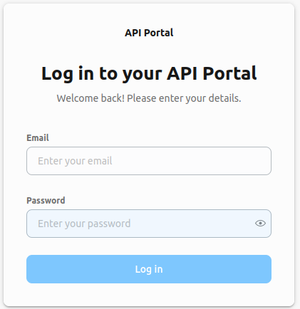

# Getting Started

## Deploy Kubernetes

In this tutorial, one can use [k3d](https://k3d.io/). Alternatives like [kind](https://kind.sigs.k8s.io), cloud providers, or others can also be used.

First, clone this GitHub repository:

```shell
git clone https://github.com/traefik/hub.git
cd traefik-hub
```

### Using k3d

```shell
k3d cluster create traefik-hub --port 80:80@loadbalancer --port 443:443@loadbalancer --port 8000:8000@loadbalancer --k3s-arg "--disable=traefik@server:0"
```

### Using Kind

kind requires some configuration to use an IngressController on localhost. See the following example:

<details>

<summary>Create the cluster</summary>

Ports need to be mapped for HTTP and HTTPS for kind with this config:

```yaml
kind: Cluster
apiVersion: kind.x-k8s.io/v1alpha4
name: traefik-hub
nodes:
- role: control-plane
  extraPortMappings:
  - containerPort: 30000
    hostPort: 80
    protocol: TCP
  - containerPort: 30001
    hostPort: 443
    protocol: TCP
```

```shell
kind create cluster --config=src/kind/config.yaml
kubectl cluster-info
kubectl wait --for=condition=ready nodes traefik-hub-control-plane
```

And add a load balancer (LB) to it:

```shell
kubectl apply -f src/kind/metallb-native.yaml
kubectl wait --namespace metallb-system --for=condition=ready pod --selector=app=metallb --timeout=90s
kubectl apply -f src/kind/metallb-config.yaml
```

</details>

## Install Traefik Hub

Log in to the [Traefik Hub Online Dashboard](https://hub.traefik.io), open the page to [generate a new agent](https://hub.traefik.io/agents/new).

**:warning: Do not install the agent, but copy the token.**

Now, open a terminal and run these commands to create the secret for Traefik Hub.

```shell
export TRAEFIK_HUB_TOKEN=
```

```shell
kubectl create namespace traefik-hub
kubectl create secret generic license --namespace traefik-hub --from-literal=token=${TRAEFIK_HUB_TOKEN}
```

After, we can install Traefik Hub with Helm:

```shell

# Add the Helm repository

helm repo add --force-update traefik https://traefik.github.io/charts
helm install traefik-hub -n traefik-hub --wait \
  --set hub.token=license \
  --set hub.apimanagement.enabled=true \
  --set ingressRoute.dashboard.matchRule='Host(`dashboard.docker.localhost`)' \
  --set ingressRoute.dashboard.entryPoints={web} \
  --set ports.web.nodePort=30000 \
  --set ports.websecure.nodePort=30001 \
   traefik/traefik
```

**If** Traefik Hub is **already** installed, we can instead upgrade the Traefik Hub instance:

```shell
# Upgrade CRDs
kubectl apply --server-side --force-conflicts -k https://github.com/traefik/traefik-helm-chart/traefik/crds/
# Update Helm Repository
helm repo update
# Upgrade Helm Chart
helm upgrade traefik-hub -n traefik-hub --wait \
  --set hub.token=license \
  --set hub.apimanagement.enabled=true \
  --set ingressRoute.dashboard.matchRule='Host(`dashboard.docker.localhost`)' \
  --set ingressRoute.dashboard.entryPoints={web} \
  --set ports.web.nodePort=30000 \
  --set ports.websecure.nodePort=30001 \
   traefik/traefik
```

Now we can access the local dashboard: http://dashboard.docker.localhost/

## Deploy an API without Traefik Hub

Without Traefik Hub, an API can be deployed with an `Ingress`, an `IngressRoute` or a `HTTPRoute`.

In this tutorial, APIs are implemented using a simple JSON server in Go; the source code is [here](../../src/api-server/).

Let's deploy a [simple weather app](../../src/manifests/weather-app.yaml) exposing an API.

```shell
kubectl apply -f src/manifests/weather-app.yaml
```

It should create the public app

```shell
namespace/apps created
configmap/weather-data created
deployment.apps/weather-app created
service/weather-app created
```

It can be exposed with an `IngressRoute`:

```yaml
---
apiVersion: traefik.io/v1alpha1
kind: IngressRoute
metadata:
  name: weather-api
  namespace: apps
spec:
  entryPoints:
    - web
  routes:
  - match: Host(`api.docker.localhost`) && PathPrefix(`/weather`)
    kind: Rule
    services:
    - name: weather-app
      port: 3000
```

```shell
kubectl apply -f src/manifests/weather-app-ingressroute.yaml
```

```shell
ingressroute.traefik.io/weather-api created
```

This API can be accessed using curl:

```shell
curl http://api.docker.localhost/weather
```

```json
{
  "public": [
    { "id": 1, "city": "GopherCity", "weather": "Moderate rain" },
    { "id": 2, "city": "City of Gophers", "weather": "Sunny" },
    { "id": 3, "city": "GopherRocks", "weather": "Cloudy" }
  ]
}
```

## Manage an API with Traefik Hub

Now, let's try to manage it with Traefik Hub using `API` and `APIAccess` resources:

```yaml
---
apiVersion: hub.traefik.io/v1alpha1
kind: API
metadata:
  name: weather-api
  namespace: apps
spec: {}

---
apiVersion: hub.traefik.io/v1alpha1
kind: APIAccess
metadata:
  name: weather-api
  namespace: apps
spec:
  apis:
    - name: weather-api
      namespace: apps
  everyone: true
```

We'll need to reference this API in the `IngressRoute` with an annotation:

```yaml
---
apiVersion: traefik.io/v1alpha1
kind: IngressRoute
metadata:
  name: weather-api
  namespace: apps
  annotations:
    hub.traefik.io/api: weather-api # <=== Link to the API using its name
spec:
  entryPoints:
    - web
  routes:
  - match: Host(`api.docker.localhost`) && PathPrefix(`/weather`)
    kind: Rule
    services:
    - name: weather-app
      port: 3000
```

Let's apply it:

```shell
kubectl apply -f api-management/1-getting-started/manifests/api.yaml
```

It will create `API`, `APIAccess` and link `IngressRoute` to this API.

```shell
api.hub.traefik.io/weather-api created
apiaccess.hub.traefik.io/weather-api created
ingressroute.traefik.io/weather-api configured
```

Now, when one tries to access the API:

```shell
curl -i http://api.docker.localhost/weather
```

It returns the expected 401 Unauthorized HTTP code:

```shell
HTTP/1.1 401 Unauthorized
Date: Mon, 06 May 2024 12:09:56 GMT
Content-Length: 0
```

## Create a user for this API

User can be created in [Traefik Hub Online Dashboard](https://hub.traefik.io/users):


This user will connect to an API Portal, so let's deploy it!

```yaml
---
apiVersion: hub.traefik.io/v1alpha1
kind: APIPortal
metadata:
  name: apiportal
spec:
  title: API Portal
  description: "Developer Portal"
  trustedUrls:
    - api.docker.localhost

---
apiVersion: traefik.io/v1alpha1
kind: IngressRoute
metadata:
  name: apiportal
  annotations:
    hub.traefik.io/api-portal: apiportal
spec:
  entryPoints:
    - web
  routes:
  - match: Host(`api.docker.localhost`)
    kind: Rule
    services:
    - name: apiportal
      port: 9903
```

:information_source: This API Portal is routed with the internal _ClusterIP_ `Service` named apiportal.

```shell
kubectl apply -n traefik-hub -f api-management/1-getting-started/manifests/api-portal.yaml
sleep 30
```

```shell
apiportal.hub.traefik.io/apiportal created
ingressroute.traefik.io/apiportal created
```

The API Portal should be accessible on http://api.docker.localhost

You should be able to log in with the admin user.



And create a token for this user:


```shell
export ADMIN_TOKEN="XXX"
```

With this token, it is possible to request the API :tada: :

```shell
curl -H "Authorization: Bearer $ADMIN_TOKEN" http://api.docker.localhost/weather
```

```json
{
  "public": [
    { "id": 1, "city": "GopherCity", "weather": "Moderate rain" },
    { "id": 2, "city": "City of Gophers", "weather": "Sunny" },
    { "id": 3, "city": "GopherRocks", "weather": "Cloudy" }
  ]
}
```
